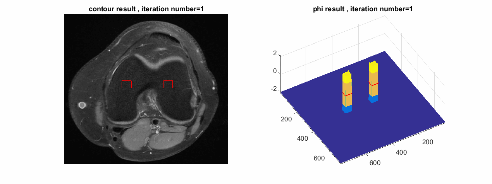
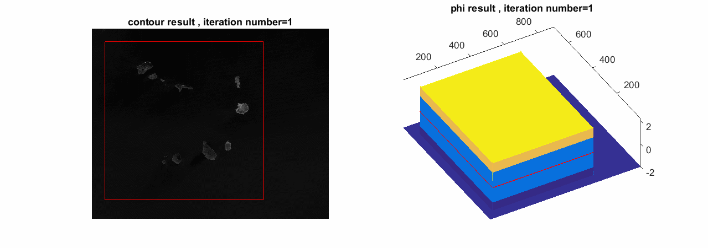
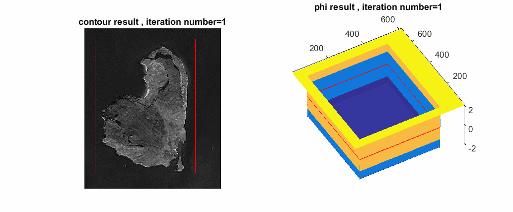

# Distance Regularized Level Set Evolution and Its Application to Image Segmentation
Level Set Evolution (LSE) is well-known method for contour extraction (determine the border of the object) and object segmentation. The main handicap of LSE is re-initialization step. This step has to be implemented to get rid of irregularities of extracted border of object (contour). Basically, level set has to be periodically re-initialize according to some distance based criteria. To the fact that how we can implement re-initialization step is not theoretical solved problem. In engineering practice, there could be significant amount of errors on to the results. In this paper, researcher proposed the new variation of LSE method which intrinsically maintains level set function instead of re-initialization step by the way of adding new term named distance regularized. That is why this new method’s name is Distance regularized LSE (DRLSE). 

## Theoretical Background:
In computer vision, “active contour” or by other name “snakes” is very important step for object detection. We can say this method is special kind of object segmentation. With this method, we need to start initial object border and the method iteratively find the object border step by step. Generally all active contour literature use energy minimization algorithm. Energy minimization’s name comes from physic. It is about the fact that all matters in our universe comes from high energy level and goes to minimum energy level. So if the matter at the minimum energy level, we can say “stable” for this matter. With this analogy, we can say if the extracted contour’s energy is at the minimum energy then it represent the border of the object as good as possible.  
In the proposed method, Level Set Function (LSF) is shown by ϕ, it is matrix with the same dimension of given image and every single cell value refer a real number in range of [-2 2] in our example. This LSF matrix ϕ, is setted initial given object region as -2 and rest of them with 2. At the last iteration we need to check  ϕ matrix, and we assign the cell, which value is 0, as a border of the object. So ϕ matrix is very important variable for us. The energy function which has to be minimize is the function of ϕ matrix as it shown in following equation in the paper [1] as follows;

ε(ϕ)=μR_p (ϕ)+λL_g (ϕ)+αA_g (ϕ)

The proposed method offer to write an energy function as a sum of 3 part which are regularized distance term R_p (ϕ)  with its weight μ, Length term L_g (ϕ)  with its weight λ, and area term A_g (ϕ)  with its weight α.  

Energy minimization algorithms aim is to find ϕ which get the energy function ε(ϕ) minimum. To solve this problem, proposed method used gradient descent algorithm which is well-known numerical analysis method.

To apply gradient descent minimization method,  we should start given initial  ϕ matrix , and we try to find derivation of given matrix with following equation in the paper [1];

L(ϕ)=∂ϕ/∂t=-∂ε(ϕ)/∂ϕ

And after finding derivative, we should update given ϕ matrix with following equation in the paper [1] as follows;

ϕ_(i,j)^(k+1)=ϕ_(i,j)^k+ΔtL(ϕ_(i,j)^k ),     where k=0,1,2,……maxiter

Where i,j indexes are the spatial location (pixel location in the image ) of the pixel in the matrix and k is the time index and it refers how many iteration we already have done.

The proposed method suggested to write an energy function as a sum of 3 part which are regularized distance term R_p (ϕ)  with its weight μ, Length term L_g (ϕ)  with its weight λ, and area term A_g (ϕ)  with its weight α.  In this function all terms are bigger than 0 but not just α. All three weight coefficient are control the effect of corresponding terms on to the energy function. For example if we get α<0 then to minimize the function object area should be as big as possible. This is caused to get big initial object border step by step. Actually if we set α≥0 then the initial area will get smaller step by step. Because optimization step try to find ϕ which get the energy function minimum. It means if we want to get bigger our object then we should set α<0 and vice versa. But λ and μ have to be bigger than 0. Because our aim is find the length of the object (circumference of object) as short as possible (Because it is for guaranty to get the object border smooth) and regularization term as small as possible. More metailed information can be found in reference paper [1].

## Implementation and pseudo Code.
All formula number were given according to original paper. please look that paper [1].
* Step 1: Read gray scale image

* Step 2: Set algorithm parameter, it has 8 parameters, these are; 
	timespan: Δt in Eq.20, in our example it is 1
	mu:  μ in Eq.30, in our example it is 0.2
	lambda:  λ in Eq.30 in our example it is 5
	alfa: α in Eq.30, in our example it is -3
	epsilon: ε in Eq.27,28,30, in our example it is 1.5
	c0: initial values of phi matrix, in our example it is 2.
	sigma: Gaussian filter variance σ, in our example it is 3
	maxiter: number of total iteration. In our example it is 750 
  
* Step 3: Smooth image with given Gaussian low-pass filter, the results of smoothed image is shown by following image

* Step 4: Calculate edge indicator according to Eq23. Edge indicator is shown by following image

* Step 5: Fill initial object region in phi matrix with –c0 and the rest of them with c0 According to Eq 19. Following image shows the initial phi matrix.

* Step 6. Check if the object border reach to the image border. Note that image border cannot go out of the image border.

* Step7. Calculate differential of Regularized term in Eq.30

* Step8. Calculate differential of Area term in Eq.30

* Step9. Calculate differential of Length term in Eq.30

* Step 10. Update phi matrix according to Eq.20

* Step 11. If maximum iteration is not reached yet return Step 6.

* Step 12. Show last updated phi and finish algorithm. Following map shows the phi matrix in some certain iteration.

## Results

The method has 8 parameters.  The most important parameter are; mu (μ), lambda  ( λ) and alfa (α) which are shown coefficient of three different components of energy function as regularization term, length term and area term respectively. This params are determined by inventor as mu=0.2, lambda=5 and alfa=-3. Basically this params shows which component is how important in our energy function. To minimize the energy function means, to minimize the sum of this components. Actually we should minimize both of this three component together. In literature it means multi-objective minimization. But to implement multi-objective minimization, we generally rewrite the function as sum of this objectives with some coefficient and this coefficient shows how important that concerned objective. If we change this coefficient than our final results might be different. 

For example lambda component try to fit the contour of objects on to edges area in the given image as much as possible. If we increase lambda then our contour goes more edges region than before and it caused the border of the object become rougher. The border of the object become far away from smoothed object and it is caused some error. But on the other hand if we decrease the lambda then the object border becomes smoother but border begin to fit on to the non-edge region and that is not actually real border. For alfa coefficient, we select negative, since our aim is to get the initial area big. Because initially we select small part of concerned region then our method should get bigger. So we expected the area coefficient should be bigger than previous iteration. That is why we should select it negative. But how negative? It depends on how the area term is important for our expectations. If we select bigger negative value then result segmentation become bigger, if we select it less negative value it is obvious that the results object border become smaller. Actually how big or how small depends on the image. This params is shows us how our object area is more or less important than the border of the object fit on to the edge region. Mu parameters refers the importance of regularized term. With this regularized term we confine the results image in range for instance -2 to +2 in our case. If we decrease this value than our results becomes more un-stabilize, on the other hand if we increase this number, the algorithm pay more attention to keep the result image in range and do not pay enough attention to the border or area.
As a results to adjust these lambda, alfa and mu coefficients are the fact of trade-off and both are interference to others value. We have all used the value that the paper offers.

Somehow epsilon (ε) and c0 parameters are belong to each other. Since c0 params shows us how many different level we use in level set function. For example in our case it is 2. It means our level set is in range of [-2 +2] whose zero set is the border of the objects. Epsilon is the parameter of Dirac and Heaviside function. It is important because the method does not evaluate the border with strict threshold. For example in our case, we do not say the value bigger than 0 is out of object and the value less than zero is the object region. Instead of this evaluation we use some epsilon threshold. For instance we used epsilon as 1.5, it means the value bigger than 1.5 is absolutely out of object and the value less than -1.5 is absolutely object region. But the value in range of [-1.5 1.5] should be evaluate the function which is used in the formula of energy function. As a results we do not select c0 and epsilon independently. Epsilon should be less than c0 and those have effect on the results especially how the results change in every single iteration. To keep the method more stabilize, we do not changed these value and used them as c0=2 and epsilon=1.5 as the value described in the paper.
In our attempts the params which we change are just maxiter, sigma and timestep values. Maxiter is the number of iteration that the algorithm has to be applied till the end. Since the method finds the results step by step we need to define how many iteration the method should apply. This number depends on the input image and given initial area. But generally we need around 1000 iteration when the timestep is equal 1. Timestep is the time resolution of numeric optimization. Basically, it is the step length in gradient descent algorithm. There is not any analytic method to define it, we should select it with empiric manner. The smaller value the stabilizer results but also the longer time consumption. If we use timestep=5, then we can reach desired result with lesser iteration. Generally these two parameters has not effect on the accuracy of the result if we implement enough number of iteration under certain timestep.

## Reference
[1] C. Li, C. Xu, C. Gui, M. D. Fox, "Distance Regularized Level Set Evolution and Its Application to Image Segmentation", IEEE Trans. Image Processing, vol. 19 (12), pp. 3243-3254, 2010.
